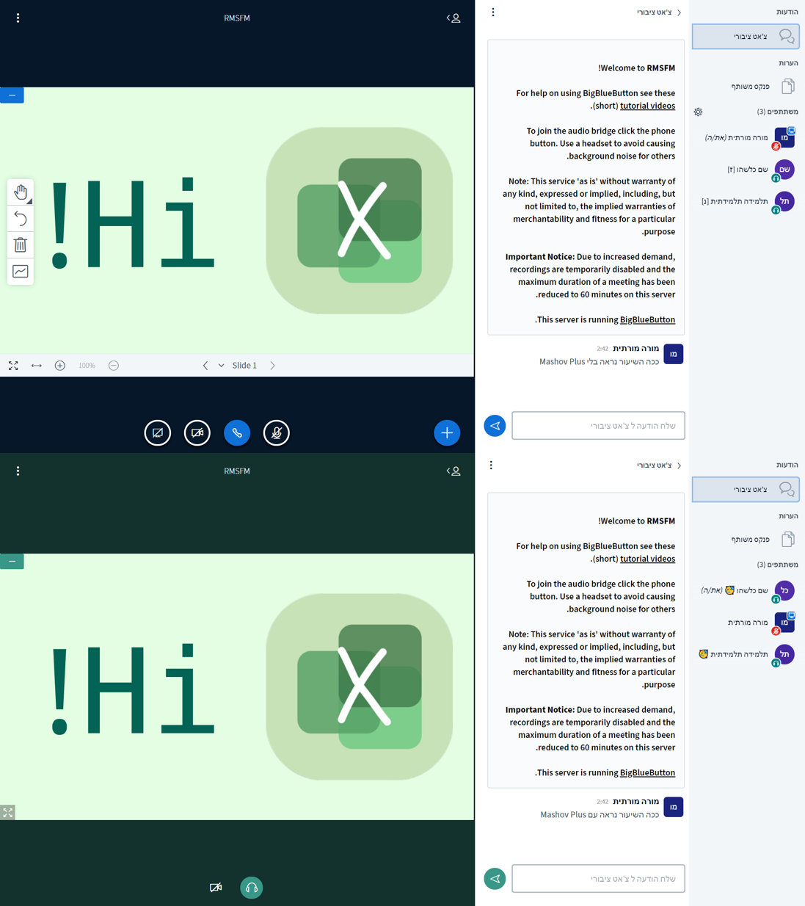

# MashovPlus

---
Mashov is a platform for school students in Israel to view grades, mail their teachers, and even take online classes.
Mashov Plus (aka RMSFM - Remove My Sex From Mashov) is an open-source Chrome extension that lets students change their name and profile picture (locally) in Mashov, choose a theme, and remove the male and female badges from Mashov's online classes system!
## History...? (ps: Nope)
---
Wait, WTF is history?! 
I literally made this extension like ten days ago.
So... what happened 10 days ago you ask?
Mashov decided to add unchangeable and annoying Male and Female tags to online classes - I hated it (IDK why I just hated it) so I made RMSFM (Remove My Sex From Mashov) - a Chrome extension that... well... removes your sex from mashov (locally but who cares?).
Then, I realized that I can use the algorithm of the "Sex remover" to change my name and some other words.
Do you think it's ended there? NO! I wanted to be able to change my profile picture and to change the theme in Mashov!
I changed the extension's name to Mashov Plus, worked hard to add these features, and now it's (almost) perfect!
I decided to make this extension open-source because I wanted you to be able to add interesting features to it or use the source code to make similar extensions.
## I'll make it short
---
In Mashov Plus, you can change your name, profile picture, and more things (like the theme, some words, the [ז] and [נ] tags, and more) in Mashov.
I made a powerful algorithm so real-time changes to the page (such as new messages in the chat) will also be included.
- ***Just a reminder that I am not associated with Mashov (The company) in any way and I am just a bored student.***
## Installation
---
- To install the last stable version, simply follow the instructions on https://minis-negevvo.tk/rmsfmweb/
- If you want to be this annoying person that doesn't like to do things as they should, clone this repo, unzip it, then go to chrome://extensions or edge://extensions (or Opera, or Kiwi, well, you got the idea), turn on developer mode and load the folder.
After the installation, You just need to open https://web.mashov.info/students/ (or https://web.mashov.info/teachers/ if you're a teacher but for obvious reasons, I couldn't guarantee it'll work).
Oh, and it also works on BigBlueButton because I tested it there, and why not?
So... enjoy...? I guess.

## Screenshots

### Mashov's homepage

### A BigBlueButton online class with and without Mashov Plus

### Mashov Plus v1.3 (pre release) UI

## License

This repository is licensed under the [MIT License](license.md).
If you want to copy the code, the repo, or anything else, please include at least one of the following and link it to this Github repo:
- Copyright (c) 2020 RMSFM by Negev Volokita
- Copyright (c) 2020 RMSFM by negevvo
